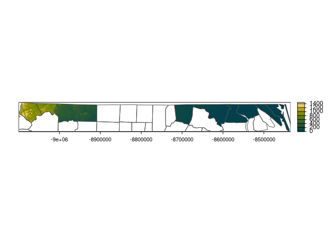

<!-- README.md is generated from README.Rmd. Please edit that file -->

<br>

</a>

# ezwarp


<!-- badges: start -->

[](https://lifecycle.r-lib.org/articles/stages.html#experimental)
[](https://codecov.io/gh/Permian-Global-Research/ezwarp)
[](https://github.com/Permian-Global-Research/ezwarp/actions/workflows/R-CMD-check.yaml)
<!-- badges: end -->

### Overview

The goal of ezwarp is to simplify the use of
[gdalwarp](https://gdal.org/programs/gdalwarp.html) in R. Gdal warp is a
very powerful and fast Image reprojection and warping utility. It can be
used to reproject (i.e. transform to a new Coordinate Reference System),
crop, mask and resample. Unlike many tools in R, this can all be done in
a single command, using the warp tool, saving time and code.

At present, there are many ways to access the functionality of gdalwarp
in R. These include:

  - [vapour::warp\_raster](https://hypertidy.github.io/vapour/reference/vapour_warp_raster.html)
  - [sf::gdal\_utils](https://r-spatial.github.io/sf/reference/gdal_utils.html)
  - [stars::st\_warp](https://r-spatial.github.io/stars/reference/st_warp.html)
  - [{gdalio}](https://github.com/hypertidy/gdalio)
  - [terra::project](https://rspatial.github.io/terra/reference/project.html)
  - [{whatarelief}](https://hypertidy.github.io/whatarelief/)
  - system(“gdalwarp …”)

Some of these packages/functions (perhaps sensibly) restrict certain
functionality of gdalwarp to make specific tasks much simpler
(e.g. ‘terra::project’ allows only a single input source).

There are two warp “engines” provided in *ezwarp*: vapour (the default)
and sf. The advantage of vapour is that it supports direct-to-memory
read of raster data so no need to store intermediate tif files. However,
when things get large, it can be problematic to load the entire dataset
into memory, in which case sf may be more suitable.

*ezwarp* provides simple access to the majority of gdalwarp’s
functionality in a simplified API that allows users to focus on the task
at hand rather than the disperate classes (and their conversions) that
exist in the r spatial ecosystem.

To warp a raster dataset, gdalwarp requires an extent, a dimension and a
projection. This can be defined in ezwarp manually using an `ezgrid`
class object which is a very simple s3 object comprising those three key
variables (created with `ezgrid()`). However, estimating raster
dimensions can be unintuitive and is a step removed from the required
spatial context on the ground. So, ezwarp provides a resolution argument
(`res`) which can be used with an ezgrid object (with or without missing
dimension value) or any of the following R spatial classes: SpatRaster,
SpatVector, sf, sfc, stars. In addition, ezwarp also supports file paths
and URLs for valid spatial files (it’s gdal after all).

terra, sf and stars are the best supported and most popular spatial
packages in the R ecosystem. *ezwarp* aims to support these types along
with vector and matrix classes (as output formats only). Further spatial
(or indeed non-spatial) classes may be supported in the future.

### Installation

``` r
# install.packages("remotes")
remotes::install_github("Permian-Global-Research/ezwarp")
```

### Examples

A very simple example, defining the grid manually with `ezgrid`. Here we
use the excellent [GEBCO
elevation](https://www.gebco.net/data_and_products/gridded_bathymetry_data/gebco_2021/)
dataset via the [Australian Antarctic Data
Centre](https://data.aad.gov.au/datasets/science/GEBCO_2021_GEOTIFF)’s
Cloud optimized Geotiff (COG). Now, clearly downloading at full
resolution would take forever. So, using gdalwarp we can resample to a
more modest resolution - in this case 0.5 degrees - by manually setting
the dimension.

Note that the output can be either a SpatRaster or stars object. Also,
see that a general plotting function `sciplot` is provided to make use
of the great scientific colour palettes provided in the
[{scico}](https://github.com/thomasp85/scico) package.

``` r
library(ezwarp)
library(terra)
template <- ezgrid(c(-180, 180, -90, 90),
  dimension = c(720, 360),
  projection = "EPSG:4326"
)

src <- "/vsicurl/https://public.services.aad.gov.au/datasets/science/GEBCO_2021_GEOTIFF/GEBCO_2021.tif"

world.el.terra <- ezwarp(x = src, y = template)
world.el.stars <- ezwarp(x = src, y = template, out_class = "stars")
sciplot(world.el.terra, pal = "bukavu", centre = TRUE)
sciplot(world.el.stars, pal = "oleron", n = 256, centre = TRUE)
```


The `cutline` argument can be used to mask regions with a input spatial
vector. Here we demonstrate this by using an online geojson of
Madagascar from the [geoboundaries
database](https://www.geoboundaries.org/downloadCGAZ.html) directly.
Note also that we reuse the source as the target `y` but set the `res`
argument to 0.5 to make sure we rescale the grid. We also specify
`crop_to_cutline = TRUE` otherwise the extent will default to that
defined by `y`. In this example, the ‘sf’ warp `engine` is used rather
than ‘vapour’.

``` r
madagascar <- "https://github.com/wmgeolab/geoBoundariesArchive_4_0_0/raw/299e00623ece6c03bcb9a751eda6094b1eac85a6/releaseData/gbOpen/MDG/ADM0/geoBoundaries-MDG-ADM0.geojson"

world.el.mask <- ezwarp(
  x = src, y = src, res = 0.1, cutline = madagascar,
  crop_to_cutline = TRUE, engine = "sf"
)

sciplot(world.el.mask, pal = "lapaz")
```


We can also pass additional arguments to gdalwarp using the options
command - See here the [gdalwarp
docs](https://gdal.org/programs/gdalwarp.html). Here we pass an sql
query for the cutline feature specifying that we only want to use Stokes
County (from the nc dataset in sf). Also the crop\_to\_cutline argument
is used here to limit the extent to the specified cropline feature. This
example also demonstrates how ezwarp handles multiple bands, in this
case with the esri satellite WMS layer. By default, all bands are read -
this can be changed with the `bands` argument.

``` r
library(sf)

esri_sat <- "<GDAL_WMS><Service name=\"TMS\"><ServerUrl>http://services.arcgisonline.com/ArcGIS/rest/services/World_Imagery/MapServer/tile/${z}/${y}/${x}</ServerUrl></Service><DataWindow><UpperLeftX>-20037508.34</UpperLeftX><UpperLeftY>20037508.34</UpperLeftY><LowerRightX>20037508.34</LowerRightX><LowerRightY>-20037508.34</LowerRightY><TileLevel>17</TileLevel><TileCountX>1</TileCountX><TileCountY>1</TileCountY><YOrigin>top</YOrigin></DataWindow><Projection>EPSG:900913</Projection><BlockSizeX>256</BlockSizeX><BlockSizeY>256</BlockSizeY><BandsCount>3</BandsCount><MaxConnections>10</MaxConnections><Cache /></GDAL_WMS>"

f <- system.file("gpkg", "nc.gpkg", package = "sf")

nc.mask <- ezwarp(
  x = esri_sat, y = esri_sat, res = 100, cutline = f,
  crop_to_cutline = TRUE, nodata = -99, engine = "sf"
)

jackson.mask <- ezwarp(
  x = esri_sat, y = esri_sat, res = 25, cutline = f,
  options = c("-csql", "SELECT * FROM 'nc.gpkg' WHERE NAME = 'Jackson'"),
  crop_to_cutline = TRUE, nodata = -99
)

f_sf <- read_sf(f) |>
  st_transform(vapour::vapour_raster_info(esri_sat)$projection)

terra::plotRGB(nc.mask)
plot(st_geometry(f_sf), add = TRUE, border = "grey90")
terra::plotRGB(jackson.mask)
plot(st_geometry(f_sf), add = TRUE, border = "grey10")
```


This example is just to illustrate that *ezwarp* can handle differing
inputs as sources - url/filepath/SpatRaster/stars and can use all of
these along with sf/sfc/SpatVector/ezgrid as a target (y) too.

``` r
nc_sub1 <- f_sf[1:10, ]
nc_sub2 <- vect(f_sf[90:100, ])

nc_sub1.terra <- ezwarp(
  x = src, y = nc_sub1, res = 100, cutline = nc_sub1,
  crop_to_cutline = TRUE
)

nc_sub2.stars <- ezwarp(
  x = src, y = nc_sub2, res = 200, cutline = nc_sub2,
  crop_to_cutline = TRUE, out_class = "stars"
)

multi.ras <- ezwarp(
  x = list(nc_sub1.terra, nc_sub2.stars),
  y = f_sf, res = 200, out_class = "stars"
)


sciplot(nc_sub1.terra, pal = "bamako")
plot(st_geometry(f_sf), add = TRUE, border = "grey30")

sciplot(nc_sub2.stars, pal = "vanimo", reset = FALSE)
plot(st_geometry(f_sf), add = TRUE, border = "grey30", reset = TRUE)

sciplot(multi.ras, pal = "romaO", reset = FALSE)
plot(st_geometry(f_sf), add = TRUE, border = "grey30", reset = TRUE)
```



A rayshader-oriented matrix output class is also supported (i.e. North
is up). This will return a matrix if the source has only one band (or
only one is requested). A multidimensional array is returned when more
than one band is present. The returned object includes *extent*,
*dimension* and *projections* attributes. This can be useful if you plan
to directly manipulate your data in R.

``` r
library(rayshader)

# get terrain as matrix
nc_dtm.mat <- ezwarp(src, jackson.mask,
  res = 50, out_class = "rayshader", nodata = -999,
  resample = "lanczos"
)
nc_dtm.mat |>
  sphere_shade(texture = "imhof4") |>
  add_shadow(ray_shade(nc_dtm.mat,
    zscale = 10, sunaltitude = 20,
    sunangle = 200,
  ), 0) |>
  plot_3d(nc_dtm.mat,
    zscale = 10, fov = 130, theta = 50, phi = 20, zoom = 0.1,
    windowsize = c(1000, 800)
  )
Sys.sleep(0.2)
render_depth(focallength = 300, clear = TRUE)
```


