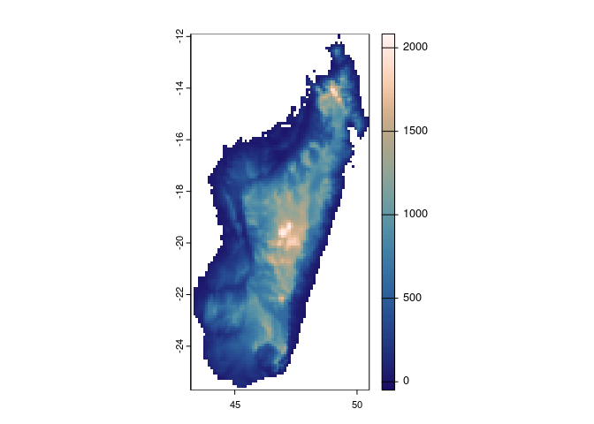

<!-- README.md is generated from README.Rmd. Please edit that file -->

# ezwarp

<!-- badges: start -->

[](https://lifecycle.r-lib.org/articles/stages.html#experimental)
<!-- badges: end -->

The goal of ezwarp is to …

make warping easy - more to come.

``` r
library(ezwarp)
library(terra)
#> terra 1.5.49
template <- ezgrid(c(-180, 180, -90, 90),
                   dimension = c(720, 360),
                   projection='EPSG:4326')

src <- "/vsicurl/https://public.services.aad.gov.au/datasets/science/GEBCO_2019_GEOTIFF/GEBCO_2019.tif"

world.el.terra <- ezwarp(x=src, y=template)
world.el.stars <- ezwarp(x=src, y=template, out_class = 'stars')
sciplot(world.el.terra, .pal='bukavu', centre=TRUE)
sciplot(world.el.stars, .pal='oleron', centre=TRUE)
#> Warning in hist.default(x[[1]], ..., main = main): argument 'main' is not made
#> use of
```


cutline…

``` r
wrld <-"/vsizip//vsicurl/https://github.com/wmgeolab/geoBoundaries/raw/main/releaseData/CGAZ/geoBoundariesCGAZ_ADM0.zip"

world.el.mask <- ezwarp(x=src, y=src, res=0.5, cutline = wrld)

sciplot(world.el.mask, .pal='lapaz', range=c(0, max(world.el.mask[], na.rm=TRUE)))
```



cutline with sql query

``` r
library(sf)

esri_sat <- "<GDAL_WMS><Service name=\"TMS\"><ServerUrl>http://services.arcgisonline.com/ArcGIS/rest/services/World_Imagery/MapServer/tile/${z}/${y}/${x}</ServerUrl></Service><DataWindow><UpperLeftX>-20037508.34</UpperLeftX><UpperLeftY>20037508.34</UpperLeftY><LowerRightX>20037508.34</LowerRightX><LowerRightY>-20037508.34</LowerRightY><TileLevel>17</TileLevel><TileCountX>1</TileCountX><TileCountY>1</TileCountY><YOrigin>top</YOrigin></DataWindow><Projection>EPSG:900913</Projection><BlockSizeX>256</BlockSizeX><BlockSizeY>256</BlockSizeY><BandsCount>3</BandsCount><MaxConnections>10</MaxConnections><Cache /></GDAL_WMS>"

f <- system.file("gpkg", "nc.gpkg", package = "sf")

nc.mask <- ezwarp(x=esri_sat, y=esri_sat, res=100, cutline = f,
                   crop_to_cutline = TRUE, nodata = -99)
#> Warning in warp_in_memory_gdal_cpp(x, source_WKT = source_projection, target_WKT
#> = projection, : GDAL Message 1: for band 1, destination nodata value has been
#> clamped to 0, the original value being out of range.

stokes.mask <- ezwarp(x=esri_sat, y=esri_sat, res=25, cutline = f,
                   options=c("-csql", "SELECT * FROM 'nc.gpkg' WHERE NAME = 'Stokes'"),
                   crop_to_cutline = TRUE, nodata = -99)
#> Warning in warp_in_memory_gdal_cpp(x, source_WKT = source_projection, target_WKT
#> = projection, : GDAL Message 1: for band 1, destination nodata value has been
#> clamped to 0, the original value being out of range.

f_sf <- read_sf(f) %>% 
  st_transform(vapour::vapour_raster_info(esri_sat)$projection)

terra::plotRGB(nc.mask)
plot(st_geometry(f_sf), add=TRUE, border='grey90')
terra::plotRGB(stokes.mask)
plot(st_geometry(f_sf), add=TRUE, border='grey10')
```


mix sources…
